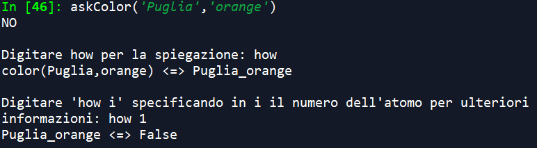

# INDICE
### <a href=#intro>1. INTRODUZIONE</a>
### <a href=#dati>2. DATI</a>
### <a href=#regioni>3. REGIONI</a>
### <a href=#previsione>4. PREVISIONE</a>
### <a href=#classificazione>5. CLASSIFICAZIONE</a>
### <a href=#percorso>6. RICERCA PERCORSO</a>
### <a href=#KB>7. BASE DI CONOSCENZA</a>

<h2 id="intro"> 1. Introduzione </h2>
Il programma affronta diverse problematiche legate alla pandemia SARS-CoV-2.

Il particolare, la gestione degli spostamenti tra regioni in base alle eventuali restrizioni.

Le restrizioni per gli spostamenti tra regioni sono imposte dal colore con cui sono contrassegnate, che indica il grado di emergenza. Più precisamente, in ordine crescente di criticità: white, yellow, orange, red.

Per una regione contrassegnata con il colore "red" (*) non è possibile superarne i confini.
>*Il divieto è limitato alle sole zone rosse al fine di riuscire a mostrare al meglio le funzionalità dell’algoritmo di ricerca dei percorsi.

Per valutare la criticità dell'emergenza SARS-CoV-2 si utilizza un EPI, ricavato da un dataset contenente l'andamento dei contagi giornaliero per ogni regione.<br><br>
```EPI (Epidemics Progression Index): https://www.cdc.gov/foodsafety/outbreaks/investigating-outbreaks/epi-curves.html```<br>

In base agli EPI analizzati nel dataset, il programma effettua una previsione sull'andamento dell'epidemia per una settimana futura.
In seguito alla previsione, con l'ausilio di un ulteriore dataset che indica l'assegnamento delle restrizioni applicate nelle settimana precedenti, effettua una classificazione dei colori (restrizioni) per la settimana futura.

Infine, basandosi sui dati calcolati, una feature permette di ricercare il percorso (ove questo esista) per effettuare uno spostamento tra due regioni date in input con l'obiettivo di correre il minor rischio possibile.


<h2 id="dati"> 2. Dati </h2>

Il programma utilizza tre differenti tipologie di data set disponibili tramite file .csv presenti su repository github:<br><br>
2.1) **Dati sulle regioni**. In particolare, un documento .csv per ogni regione in cui vengono indicati, suddivisi per giorni, i dati relativi ai casi totali per regione e numero di tamponi effettuati.<br>
Ad esempio la tabella della regione Puglia è così strutturata:<br><br>
<br><br>
Questi dati verranno utilizzati dal programma al fine del calcolo dell’EPI.<br><br>
2.2) Per il task della classificazione invece, viene utilizzata la tabella seguente, la quale contiene **aggiornamenti settimanali sui colori (restrizioni)** assegnati alle regioni.<br><br>
<br><br>
2.3) Dati inerenti la popolazione di ogni regione per effettuare con una maggiore precisione il task di classificazione<br><br>
<br>

<h2 id="regioni"> 3. Regioni</h2>
Nel programma ogni regione è stata rappresentata mediante un'apposita classe (Regione.py), così definita:<br><br>
<table>
<tr><td>Attributi</td></tr>
<tr><td>name</td><td>Nome della regione</td></tr>
<tr><td>epi</td><td>EPI medio calcolato per la settimana futura rispetto agli utimi dati registati nel dataset</td></tr>
<tr><td>color</td><td>Colore ("white","yellow","orange","red") che indica il grado di criticità dei contagi</td></tr>
</table>
<table>
<tr><td>Metodi</td></tr>
<tr><td>avgEPIByDate (self, dataCalcolo)</td><td>Metodo per il calcolo dell'EPI medio, a partire da una settimana prima fino ad una data passata in input</td></tr>
<tr><td>avgEPI (self)</td><td>Metodo per il calcolo dell'EPI medio calcolato per la settimana futura rispetto agli ultimi dati registrati nel dataset</td></tr>
<tr><td>printGraphics(self)</td><td>Metodo per la visualizzazione dei grafici inerenti l'andamento dei contagi registrati nelle ultime due settimane (prima della previsione) e la curva epidemiologica della previsione (con relativi margini di errore)</td></tr>
</table>


<h2 id="previsione"> 4. Previsione</h2>
L’applicazione, mediante l’accesso ad un data set, permette di effettuare delle predizioni sull’andamento del tasso di contagiosità (EPI) nella settimana seguente rispetto a quella dei dati di training.

In particolare, la previsione viene effettuata per ogni singola regione, mediante l’apposito metodo avgEPI della classe Regione. Per effettuare la previsione, il programma si basa sull’utilizzo di un **regressore lineare** che opera con le informazioni relative agli ultimi 14 giorni presenti nel dataset mostrato precedentemente nella sezione Dati.
> La **regressione lineare** è una tecnica di modellazione statistica utilizzata per descrivere una varabile di risposta continua in funzione di una o più variabili (predittori). Può contribuire a comprendere e a prevedere il comportamento di sistemi complessi, nonché ad analizzare dati.
Le regressioni lineari hanno delle proprietà che le rendono particolarmente utili per effettuare **predizioni o previsioni** (utilizzo di un modello di regressione per creare un modello di previsione per un set di dati specifico; dal modello, è possibile usare la regressione per prevedere i valori di risposta quando sono noti solo i predittori).


Il programma quindi, con l’ausilio del regressore lineare, calcola un ipotetico andamento della curva epidemiologica, che viene mostrato e visualizzato all’interno di grafici generati dal programma, affinchè si possa fornire una rappresentazione più intuitiva ai tassi di contagiosità calcolati per la settimana successiva.

Inoltre, il programma calcola anche l’**errore massimo e minimo** commesso dal modello nella predizione, e anch’esso viene mostrato nel grafico insieme all’andamento della curva previsto.<br>


I **grafici** con tutte queste informazioni vengono mostrate richiamando sull’oggetto Regione d’interesse, il metodo printGraphics.

<h2 id="classificazione"> 5. Classificazione</h2>
Il programma, raccogliendo dati sulle restrizioni associate ad ogni regione nelle ultime settimane, utilizza un albero di decisione per classificare le regioni nella settimana oggetto della predizione.<br><br>

>Un albero di decisione è un albero di classificatori (Decision Stump) dove ogni nodo interno è associato ad una particolare “domanda” su una caratteristica (feature). Da questo nodo dipartono tanti archi quanti sono i possibili valori che la caratteristica può assumere, fino a raggiungere le foglie che indicano la categoria associata alla decisione.

L'albero di decisione utilizzato dalla funzione di classificazione potrà essere stampato a video dall'utente richiamando la funzione "printTree()".<br><br>


In particolare utilizza come **training set** l'elenco delle regioni a cui sono associati: 
1. Come feature di **input**, di ogni regione, il **numero di abitanti** e l'**EPI medio** calcolato nella settimana d'interesse;<br>
2. Come **target** il **colore** assegnato alla regione nella settimana d'interesse.<br>
Il numero di abitanti di ogni regione viene rilevato dalla tabella "TrainingSet(Popolazione).csv", il colore per la settimana presa in considerazione viene rilevato dalla tabella "TrainingSet(Colori).csv", mentre l'EPI medio della settimana viene calcolato appositamente dalla funzione avgEPIByDate(self,dataCalcolo) descritta nella sezione 'Regione' che permette di calcolare il valore richiesto passando in input l'ultimo giorno della settimana.

Allenandosi su questi dati, l'albero di decisione sarà in grado di assegnare alle regioni il colore corretto per la settimana oggetto della  previsione, basandosi sulle stesse feature di input "popolazione" ed "EPI" (predetto dalla funzione di previsione).

Il classificatore potrà essere mandato in esecuzione dall'utente mediante la funzione "printColors()", la quale stamperà a video i colori assegnati ad ogni regione nel seguente modo: <br><br>
<br><br>

<h2 id="percorso"> 6. Ricerca Percorso</h2>
L’applicazione, a partire da tutte istanze dalla classe Regione, genera un grafo in cui i nodi saranno proprio gli oggetti della classe Regione, nonché proprio le regioni italiane, e gli archi collegheranno invece tutte quelle regioni che sono confinanti fra loro.<br><br>

>Un grafo è un insieme di elementi detti nodi o vertici che possono essere collegati fra loro da linee chiamate archi o lati o spigoli. Più formalmente, si dice grafo una coppia ordinata G=(V,E) di insiemi, con V insieme dei nodi ed E insieme degli archi, tali che gli elementi di E siano coppie di elementi di V.

Modellando in questo modo il dominio delle regioni italiane, e sfruttando le previsioni fatte sull’andamento del tasso di contagiosità per ciascuna di queste, l’applicazione rende possibile la ricerca di un percorso che va da una regione di partenza ad una di destinazione nel rispetto delle restrizioni.

Le restrizioni in questione sono quelle previste dal programma per la settimana successiva a quella dei dati di training, come descritto nelle sezioni “Previsione” e “Classificazione”. Le restrizioni da rispettare saranno in particolare quelle relative alle regioni contrassegnate dal colore ‘red’, e quindi da un elevato tasso di contagiosità che ne vieterà l’attraversamento. Questo, implica che non sempre il calcolo del percorso da una regione ad un’altra potrà essere calcolato.

La ricerca del percorso dovrà tener conto anche del rischio di contagio che si corre nell’attraversare una determinata sequenza di regioni. Pertanto, il grafo delle regioni sarà un grafo pesato in cui l’arco che collega due regioni avrà un peso pari alla media del tasso di contagiosità delle due regioni. In questo modo, si evita di scegliere percorsi che prevedano l’attraversamento di una regione con un tasso di contagiosità elevato.

 Quindi, per implementare questa ricerca, si è scelto di utilizzare un algoritmo che preveda la ricerca a costo minimo, ma che inoltre tenga conto anche di conoscenza aggiuntiva.

Questa conoscenza viene definita in un’apposita funzione di euristica che aiuta l’algoritmo di ricerca a stimare il costo di arrivo verso una determinata regione.

In particolare, la funzione di euristica deve sottostimare il costo effettivo per raggiungere un nodo di destinazione del grafo a partire da un determinato nodo.

Quindi, ad esempio, per calcolare il costo del percorso dalla regione Puglia alla regione Lazio, dovremo considerare il costo per raggiungere la regione Basilicata, più il valore della funzione euristica calcolato sulla regione Basilicata per la regione Lazio.

In questo modo verranno scelte come prossimo step della ricerca, le regioni che avranno il minimo valore della somma tra costo effettivo e valore della funzione euristica.
L’algoritmo di ricerca utilizzato per tenere in considerazione tutto ciò è A*.

>A* è un algoritmo di ricerca e ottimizzazione basato su grafi. Viene frequentemente impiegato nell’intelligenza artificiale perché in grado di gestire grafi ampi e indeterminati. In generale, A* può risolvere efficacemente i problemi che soddisfano i requisiti:<br> - La soluzione è determinata da cambiamenti sequenziali di stato rappresentabili con grafi;<br> - Il nodo iniziale e il nodo finale devono essere noti;<br> - Deve essere noto un algoritmo euristico che stima il costo del percorso tra un nodo qualsiasi e la soluzione;<br> - Deve essere sempre noto il costo che separa due nodi adiacenti. (Nella maggioranza dei problemi tale valore è sempre unitario). <br> <br> A* rientra nella categoria degli algoritmi di ricerca best-first. Esso infatti esamina, passo dopo passo, i nodi che hanno il punteggio migliore. Esso tuttavia non è *greedy* in quanto il punteggio non è determinato esclusivamente dall’euristica.

L'utente può ricercare un percorso tra regioni mediante la funzione "findPath('NomeRegione1','NomeRegione2')", inserendo il nome delle regioni con le apposite diciture (ValleAosta, Piemonte, Lombardia, Liguria, EmiliaRomagna, Veneto, TrentinoAltoAdige, FriuliVeneziaGiulia, Toscana, Marche, Umbria, Lazio, Abruzzo, Campania, Molise, Puglia, Basilicata, Calabria, Sardegna, Sicilia).

Se esiste un percorso tra due regioni, l'algoritmo restituirà il percorso meno rischioso per transitare dalla regione di partenza a quella di destinazione.<br><br>
<br><br>
Altrimenti l'output sarà 'None'.<br><br>


<h2 id="KB"> 7. Base di conoscenza</h2>
Con l'obiettivo di fornire un supporto all'interpretazione dei passi effettuati dalla ricerca, al programma è stata aggiunta una base di conoscenza.<br>
>Una base di conoscenza è un database in cui sono archiviate e organizzate le conoscenze in un particolare ambito o generali. La base di conoscenza è spesso indicata anche con il termine inglese knowledge base o con l'acronimo KB.<br>
Utilizzando la base di consocenza è possibile ricavare informazioni aggiuntive inerenti le condizioni di attraversamento di due regioni.
In particolare, le query effettuabili sono:<br>
1. askColor("Regione","Colore"), permette di interrogare la base di consocenza per stabilire se alla "Regione" è assegnato un determinato 
"Colore";<br>
<br><br>
2. askPassaggio("Regione1","Regione2"), permette di interrogare la base di consocenza per stabilire se la "Regione1" e la "Regione2" sono adiacenti e prive di restrizioni per poter effettuare lo spostamento.<br>
<br><br>
Per ogni query, viene fornita una risposta: YES / NO in base alla veridicità della clausula che si vuole dimostrare.
In seguito ad una risposta, è possibile utilizzare l'operatore HOW per chiedere di spiegare come sia stata provata la risposta.
